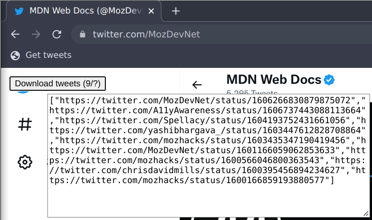

# bookmarklet-twitter-bookmarks

[Bookmarklet to get an array of links to the tweets on any twitter page.](getTweets.js) Useful for getting links to your bookmarked tweets for further archiving. Keep scrolling to load all tweets (as you scroll the tweets disappear off screen but the bookmarklet retains their links).

To use a [bookmarklet](https://en.wikipedia.org/wiki/Bookmarklet), add a new bookmark in your browser and copy the code into it as URL. Then on the target page use the bookmark.
